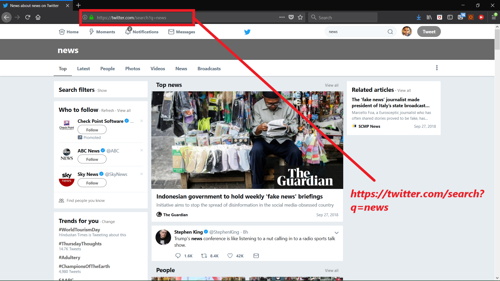
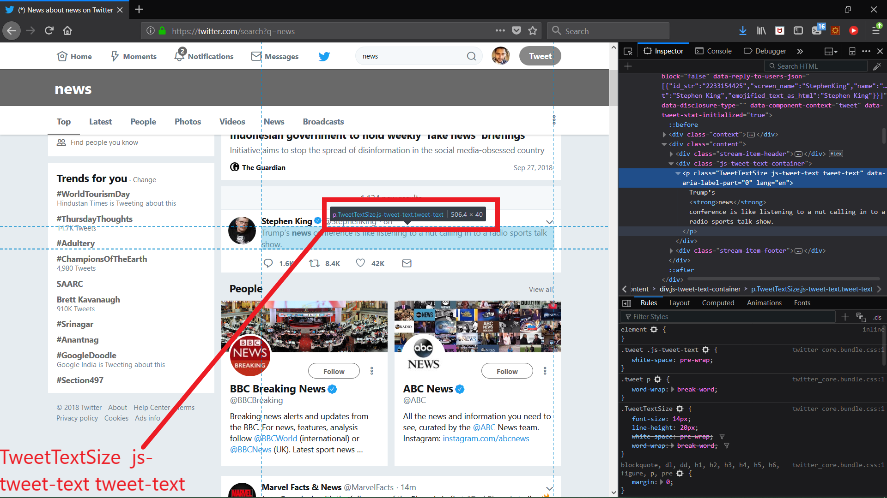

# Twitter Scraping
Twitter scrapping can be done in variety of ways. This repository works with one such solution.

## Logic behind this tweet_scrape.py
* Twitter is a social media platform that doesn't restrict "ethical" bot usage.
* Twitter's Search query page: [https://twitter.com/search-home](https://twitter.com/search-home) gives us access to a whole lot of tweets belonging to a particular query. Let's make a search request and see the results!

||
|:-----:|
|Search query on twitter|

* Now we know that making a query with a word can be made using syntax https://twitter.com/search?q=<word>
* But how to get specific tweet?
  - Looking closely on inspection using dev tools in browser that each tweet belongs to a css class - "tweet-text".

||
|:-----:|
|Search query on twitter|

* How can we do it programmatically?
  - Selenium allows us to control a browser using simple programmable controls and even get the elements by class.
  - This means we can scroll down and load more tweets (selenium.webdriver.common.keys.Keys.PAGE_DOWN), and on the same time access specific css classes (selenium.webdriver.<Chrome/Firefox Driver>.find_elements_by_class_name('tweet-text')).

## Usage
```
usage: tweet_scrape.py [-h] [-dt DT] [-dp DP] [-src SRC] [-nst NST]
                       [-dest DEST]

optional arguments:
  -h, --help  show this help message and exit
  -dt DT      Driver type, supported drivers: 0 - Chrome, 1 - Firefox Default
              - 0
  -dp DP      Driver path, Default "" - in this case driver is assumed to be
              specified on path
  -src SRC    Source of file that contains words that needs to be in the
              tweets Default - "words.txt"
  -nst NST    Load tweets for nst seconds per topic and username. Default=50
  -dest DEST  Destination to which we need to store a tweet a line.
              Default="tweets.txt"
```

## Json Parsing
* `json_parse.py` uses twitter API credentials that should be defined in a file "credentials.json".
* The script in context make an auth connection and calls home_timeline.json sub root of the API to get tweets. These tweets are parsed to tweets.csv
